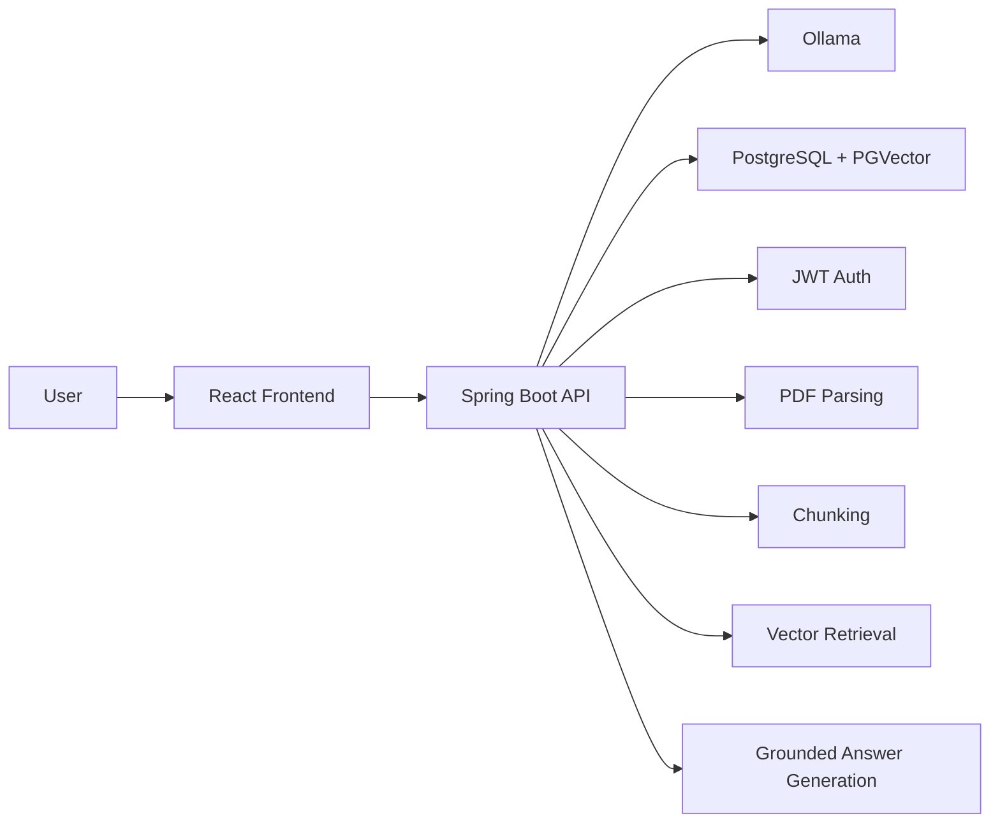

# DocuMind AI

DocuMind AI is a full-stack RAG-based document question answering system built with Spring Boot, React, Ollama, and PGVector.

Users can:
- create an account and log in
- upload PDF documents
- generate embeddings and store them in PGVector
- ask questions grounded in uploaded documents
- view source chunks used for each answer
- manage indexed documents
- save and reopen previous chat conversations
- work inside isolated user-specific document spaces

## Tech Stack

- Backend: Java 21, Spring Boot, Spring AI, Spring Security, Spring Data JPA
- Frontend: React, Vite
- LLM / Embeddings: Ollama (`qwen2.5:1.5b`, `nomic-embed-text`)
- Vector Database: PostgreSQL with PGVector
- Document Parsing: LangChain4j + Apache PDFBox
- Auth: JWT
- Infra: Docker, Docker Compose

## Features

- PDF ingestion with chunking and overlap control
- Semantic retrieval using PGVector similarity search
- Retrieval-augmented generation with grounded responses
- Source previews for transparency
- Configurable RAG tuning:
  - `topK`
  - similarity threshold
  - chunk size
  - chunk overlap
  - prompt context limits
- Rolling latency metrics for chat responses
- Persistent conversation history
- Authentication and per-user workspace isolation

## Architecture



## How It Works

### 1. Document Upload

1. User uploads a PDF
2. Backend extracts text using PDFBox
3. Text is normalized and split into chunks
4. Each chunk is embedded using Ollama embeddings
5. Embeddings are stored in PGVector with metadata such as:
   - `filename`
   - `chunkIndex`
   - `userId`

### 2. Question Answering

1. User asks a question
2. Backend filters vector search by the authenticated user
3. Optional document-specific filtering is applied
4. Top matching chunks are retrieved from PGVector
5. A grounded prompt is built from those chunks
6. Ollama generates a response using only retrieved context
7. The API returns:
   - answer
   - sources
   - scope
   - duration
   - model name
   - conversation ID

### 3. Conversation Persistence

Each question/answer exchange is stored in the database.

Users can:
- start a new chat
- continue an existing conversation
- reopen previous sessions later

## Project Structure

```text
docbot/
├── src/main/java/com/example/docbot
│   ├── config
│   ├── controller
│   ├── dto
│   ├── entity
│   ├── repository
│   ├── security
│   └── service
├── src/main/resources
├── frontend/
│   ├── src
│   ├── package.json
│   └── Dockerfile
├── docker-compose.yml
├── Dockerfile
└── pom.xml
```

## API Overview

### Auth

- `POST /auth/signup`
- `POST /auth/login`
- `GET /auth/me`

### Documents

- `POST /documents/upload`
- `GET /documents`
- `DELETE /documents/{filename}`

### Chat

- `POST /ai/conversations/ask`
- `GET /ai/conversations`
- `GET /ai/conversations/{conversationId}`
- `GET /ai/metrics`

### Legacy Ask Endpoint

- `GET /ai/ask?message=...`
- `GET /ai/ask?message=...&filename=...`

## Example Request / Response

### Signup

```http
POST /auth/signup
Content-Type: application/json

{
  "username": "demoauth",
  "password": "demo123"
}
```

```json
{
  "token": "jwt-token",
  "userId": "user-id",
  "username": "demoauth"
}
```

### Ask a Question in a Saved Conversation

```http
POST /ai/conversations/ask
Authorization: Bearer <token>
Content-Type: application/json

{
  "conversationId": null,
  "message": "What is Python?",
  "filename": "Python Notes.pdf"
}
```

```json
{
  "conversationId": "conversation-id",
  "question": "What is Python?",
  "answer": "Python is a high-level programming language...",
  "sources": [
    {
      "filename": "Python Notes.pdf",
      "chunkIndex": "1",
      "preview": "Python is a high-level programming language..."
    }
  ],
  "scope": "Python Notes.pdf",
  "durationMs": 81570,
  "model": "qwen2.5:1.5b"
}
```

## Running Locally

### Prerequisites

- Docker Desktop

### Start the Project

```bash
docker compose up --build
```

### Default URLs

- Frontend: [http://localhost:5173](http://localhost:5173)
- Backend API: [http://localhost:8080](http://localhost:8080)
- Ollama: `http://localhost:11434`
- PostgreSQL: `localhost:5432`

## Production Deployment

The simplest production setup for this project is a Linux VPS running Docker Compose.

### Recommended Stack

- Ubuntu VPS on AWS EC2, DigitalOcean, Hetzner, or Azure
- Docker Engine + Docker Compose plugin
- This repository cloned on the server
- `docker-compose.prod.yml` for the app stack
- GitHub Actions for CI and SSH-based deployment

### Files Added for Deployment

- [docker-compose.prod.yml](C:/Users/HP/Downloads/docbot/docker-compose.prod.yml)
- [.env.prod.example](C:/Users/HP/Downloads/docbot/.env.prod.example)
- [.github/workflows/ci.yml](C:/Users/HP/Downloads/docbot/.github/workflows/ci.yml)
- [.github/workflows/deploy.yml](C:/Users/HP/Downloads/docbot/.github/workflows/deploy.yml)

### 1. Prepare the VPS

Install Docker and clone the repository:

```bash
sudo apt update
sudo apt install -y docker.io docker-compose-plugin git
sudo usermod -aG docker $USER
git clone <your-repo-url>
cd docbot
```

Create the production environment file:

```bash
cp .env.prod.example .env.prod
```

Then edit `.env.prod` and set:

- `POSTGRES_PASSWORD`
- `APP_AUTH_JWT_SECRET`
- `VITE_API_BASE_URL`

### 2. Start the Production Stack

```bash
docker compose -f docker-compose.prod.yml --env-file .env.prod up -d --build
```

Pull the Ollama models used by the app:

```bash
docker exec documind-ollama ollama pull qwen2.5:1.5b
docker exec documind-ollama ollama pull nomic-embed-text
```

### 3. GitHub Secrets for Deployment

Add these repository secrets:

- `VPS_HOST`
- `VPS_USER`
- `VPS_SSH_KEY`
- `VPS_PORT`
- `VPS_APP_DIR`

`VPS_APP_DIR` should be the absolute path of the cloned repo on the server, for example:

```text
/home/ubuntu/docbot
```

### 4. GitHub Actions Workflows

#### CI workflow

The CI workflow:
- runs backend tests with Maven
- builds the React frontend
- validates both Docker images

#### Deploy workflow

The deploy workflow:
- triggers on pushes to `main` or manually
- connects to the VPS over SSH
- pulls the latest code
- rebuilds and restarts the production containers
- makes sure the Ollama chat and embedding models are present on the server

### Production Notes

- The frontend production image now serves static files with Nginx instead of running the Vite dev server.
- Ollama model files and PostgreSQL data persist in Docker volumes.
- For a custom domain, put Nginx Proxy Manager, Caddy, or a reverse proxy in front later.

## Important Configuration

Main backend configuration lives in [application.properties](C:/Users/HP/Downloads/docbot/src/main/resources/application.properties).

Current notable defaults:
- chat model: `qwen2.5:1.5b`
- embedding model: `nomic-embed-text`
- `topK=3`
- similarity threshold `0.40`
- chunk size `1500`
- chunk overlap `200`

## Security Notes

- Authentication uses JWT
- API routes other than `/auth/**` require a bearer token
- Vector search is filtered by `userId`
- Conversations and documents are isolated per user

This repository currently uses a local development JWT secret in `application.properties`.
For production deployment, move secrets to environment variables.

## Resume Value

This project demonstrates:
- full-stack application development
- retrieval-augmented generation
- vector databases
- LLM integration with Ollama
- secure multi-user backend design
- conversation persistence
- Dockerized local deployment

This makes it a strong fresher-level project because it is not just a CRUD app or a plain chatbot. It solves a real workflow end to end.

## Future Improvements

- stronger evaluation pipeline for RAG quality
- page-level citations
- better retrieval reranking
- deployment to a public cloud environment
- admin dashboards and usage analytics
- tests for auth, retrieval, and conversations

## Author

Built as a personal full-stack AI project focused on document intelligence, RAG systems, and practical LLM application design.
