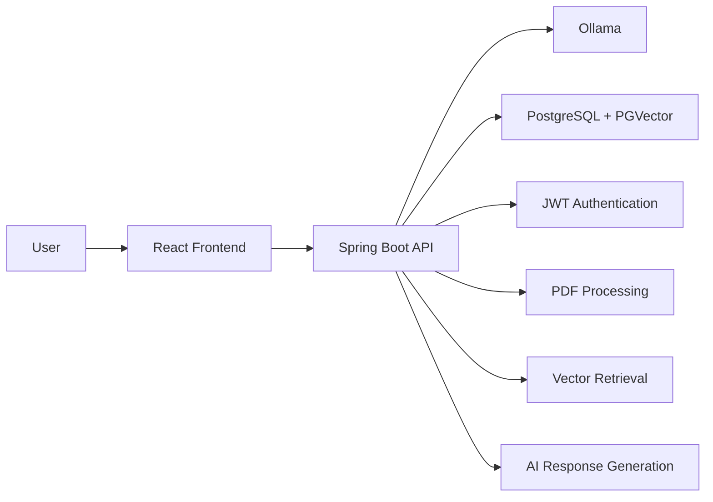

# DocuMind AI

DocuMind AI is a full-stack RAG (Retrieval-Augmented Generation) based document question-answering system built using Spring Boot, React, Ollama, and PostgreSQL with PGVector.

The application allows users to upload PDF documents, generate embeddings, and ask AI-powered questions grounded in uploaded documents.

## Features

- User authentication with JWT
- PDF document upload and management
- AI-powered question answering using RAG
- Semantic search with PGVector
- Source chunk previews for transparency
- Persistent chat conversations
- User-specific document isolation
- Configurable retrieval settings
- Dockerized setup for easy deployment

---

## Tech Stack

### Backend
- Java 21
- Spring Boot
- Spring Security
- Spring Data JPA
- Spring AI

### Frontend
- React
- Vite

### AI & Vector Search
- Ollama (`qwen2.5:1.5b`)
- Embedding Model: `nomic-embed-text`
- PostgreSQL + PGVector

### Additional Tools
- Apache PDFBox
- LangChain4j
- Docker & Docker Compose
- JWT Authentication

---

## System Architecture



---

## How It Works

### 1. Document Upload
- User uploads a PDF document
- Backend extracts text using PDFBox
- Text is split into chunks
- Embeddings are generated using Ollama
- Embeddings are stored in PGVector

### 2. Question Answering
- User asks a question
- Relevant document chunks are retrieved
- Context-aware prompt is generated
- Ollama produces a grounded response
- Answer with source references is returned

### 3. Conversation History
- Chat sessions are stored in the database
- Users can continue previous conversations
- Saved conversations can be reopened anytime

---

## Project Structure

```text
docbot/
├── backend/
│   ├── config/
│   ├── controller/
│   ├── dto/
│   ├── entity/
│   ├── repository/
│   ├── security/
│   └── service/
│
├── frontend/
│   ├── src/
│   ├── package.json
│   └── Dockerfile
│
├── docker-compose.yml
├── Dockerfile
└── pom.xml
```

---

## API Endpoints

### Authentication
```http
POST /auth/signup
POST /auth/login
GET /auth/me
```

### Document Management
```http
POST /documents/upload
GET /documents
DELETE /documents/{filename}
```

### Chat
```http
POST /ai/conversations/ask
GET /ai/conversations
GET /ai/conversations/{conversationId}
GET /ai/metrics
```

---

## Installation & Setup

### Prerequisites
Make sure you have installed:

- Docker Desktop
- Java 21
- Node.js

### Clone Repository

```bash
git clone <your-repository-url>
cd docbot
```

### Run Using Docker

```bash
docker compose up --build
```

---

## Default Services

| Service | URL |
|----------|-----|
| Frontend | http://localhost:5173 |
| Backend API | http://localhost:8080 |
| Ollama | http://localhost:11434 |
| PostgreSQL | localhost:5432 |

---

## Configuration

Key configuration options include:

```properties
topK=3
similarityThreshold=0.40
chunkSize=1500
chunkOverlap=200
```

Models Used:
- Chat Model: `qwen2.5:1.5b`
- Embedding Model: `nomic-embed-text`

---

## Security

- JWT-based authentication
- Protected API routes
- User-specific document isolation
- Secure vector search filtering

---

## Future Enhancements

- Citation-based answers
- Retrieval reranking
- Cloud deployment
- Analytics dashboard
- Unit & integration testing
